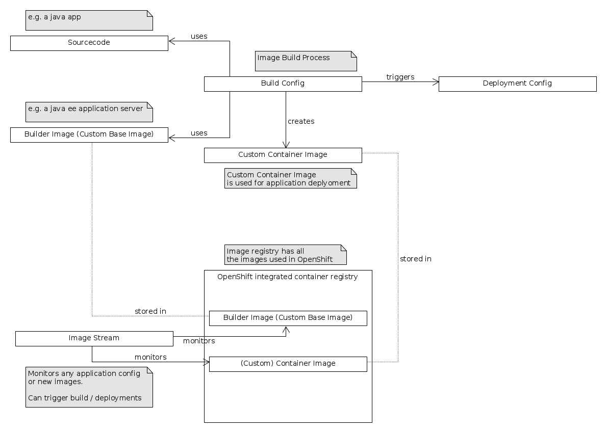

# Table of Content
1. [odo](#odo-openshift-do)
2. [azure](#openshift-on-azure)
3. [container](#docker-container-alternatives)
4. [openshift](#openshift)
5. [quarkus](#quarkus-example)
6. [sammple app](#sample-application)
7. [crc](#codeready-containers)
8. [minishift](#minishift)
9. [cheatsheet](#cheatsheet)

_OpenShift is a Kubernetes platform_

# odo
* odo: OpenShift Do
* developer-focused CLI for OpenShift 
* get odo
```
curl -L https://mirror.openshift.com/pub/openshift-v4/clients/odo/latest/odo-linux-amd64 -o odo
```
* make it runnable
```
chmod +x odo
```
* list developer catalog
```
odo catalog list components
```
* https://docs.openshift.com/container-platform/4.2/cli_reference/openshift_developer_cli/understanding-odo.html

# openshift on azure
https://github.com/kedacore/keda/wiki/Using-Keda-and-Azure-Functions-on-Openshift-4

# docker container alternatives
* OCI container: buildah, google jib, ...

# openshift

__container__

_Containers in OpenShift Container Platform are based on OCI- or Docker-formatted container images._

__(container) image, builder image / base image, custom / application image, image streams__
* builder image: e.g. a application server
* custom image: e.g. application server and your app
* container images are stored in image registry e.g. docker hub, quay.io,registry.access.redhat.com
    * openshift has an internal image registry
    * https://blog.openshift.com/image-streams-faq/
    * https://itnext.io/variations-on-imagestreams-in-openshift-4-f8ee5e8be633



_OpenShift in Action_
> * Image streams monitor for changes and trigger new deployments and builds for applications.
> * Build configs track everything required to build an application deployment.
> * Deployment configs keep track of all information required to deploy an application.
> * Pods are the default unit of work. They’re where your application code is served.
> * Deployments are unique deployed versions of an application.
> * Container images are the template used to deploy application pods.
> * Services are a consistent interface for all the application pods for a deployment.
> * Routes are external-facing, DNS-based load-balancer entries that are connected to services.
> * Replication controllers ensure that the desired number of application pods is running at all times.

application components:
> * Custom container images
> * Image streams
> * Application pods
> * Build configs
> * Deployment configs
> * Deployments
> * Services

> how OpenShift creates and uses custom container images for each application.

> Each application deployment in OpenShift creates a custom container image to serve your application. This image is created using the application’s source code and a custom base image called a _builder image_.

> 1. OpenShift creates a custom container image using your source code and the builder image template you specified. For example, app-cli and app-gui use the PHP builder image.
> 2. This image is uploaded to the OpenShift container image registry.
> 3. OpenShift creates a build config to document how your application is built. This includes which image was created, the builder image used, the location of the source code, and other information.
> 4. OpenShift creates a deployment config to control deployments and deploy and update your applications. Information in deployment configs includes the number of replicas, the upgrade method, and application-specific variables and mounted volumes.
> 5. OpenShift creates a deployment, which represents a single deployed version of an application. Each unique application deployment is associated with your application’s deployment config component.
> 6. The OpenShift internal load balancer is updated with an entry for the DNS record for the application. This entry will be linked to a component that’s created by Kubernetes, which we’ll get to shortly.
> 7. OpenShift creates an image stream component. In OpenShift, an image stream monitors the builder image, deployment config, and other components for changes. If a change is detected, image streams can trigger application redeployments to reflect changes.

__build strategies__
* Docker build
    * expects a repository with a _Dockerfile_
* Source-to-Image (S2I) build
    * builder image: injecting sourcecode into a container (base/builder) image and assemble a new image.
    * _OpenShift Container Platform also supplies builder images that assist with creating new images by adding your code or configuration to existing images._
    * base image (docker context): _A base image has FROM scratch in its Dockerfile._
* Custom build
* Pipeline build strategy (CI/CD)
    * Pipeline workflows are defined in a _Jenkinsfile_ or embedded directly in the build configuration
* https://docs.openshift.com/container-platform/4.2/builds/understanding-image-builds.html
* Override the build strategy by setting the --strategy flag to either pipeline or source.
```
$ oc new-app /home/user/code/myapp --strategy=docker
```
* https://docs.openshift.com/container-platform/4.2/applications/application-life-cycle-management/creating-applications-using-cli.html#build-strategy-detection
* https://docs.openshift.com/container-platform/4.2/builds/understanding-image-builds.html#build-strategy-s2i_understanding-image-builds
* https://developer.ibm.com/tutorials/creating-your-own-source-to-image-entry-openshift/
* https://docs.docker.com/develop/develop-images/baseimages/
* https://docs.openshift.com/container-platform/4.2/openshift_images/images-understand.html#images-about_images-understand

__UBI Images__
* S2I (Source to Image) are builder images used by OpenShift to build image streams.
* UBI images:
    * GraalVM Native S2I
    * Binary S2I
* https://github.com/quarkusio/quarkus-images

## create builder image

__example__

* folder: `s2i-payara/`
* created with: 
```
s2i create <imageName> <destination>
s2i create payara-builderimage s2i-payara
```

__links__

* https://docs.openshift.com/container-platform/3.11/creating_images/s2i.html#s2i-scripts
* https://blog.openshift.com/create-s2i-builder-image/?extIdCarryOver=true&intcmp=7013a000002CtetAAC&sc_cid=701f2000001OH6pAAG

__S2I__

Let see what the tool s2i https://github.com/openshift/source-to-image/releases/ says:
> Source-to-image (S2I) is a tool for building repeatable docker images.

> A command line interface that injects and assembles source code into a docker image.

# quarkus example
https://quarkus.io/guides/deploying-to-openshift-s2i

__create app__
```
oc new-app quay.io/quarkus/ubi-quarkus-native-s2i:19.2.1~https://github.com/quarkusio/quarkus-quickstarts.git --context-dir=getting-started --name=quarkus-quickstart-native
```
* tag `19.3.0-java11` doesnt worked for me.
* https://quay.io/repository/quarkus/ubi-quarkus-native-s2i?tag=latest&tab=tags

__expose service to the outside world__
```
oc expose svc/quarkus-quickstart-native
```

__delete all resources__
```
oc delete all --selector app=quarkus-quickstart-native
```

# sample application
Simple demonstration of S2I. OpenShift will pull source (our webapp) and build an image based on Wildfly (Application Server).

Our Webapp has a index.html page and one REST API.


# CodeReady Containers
* OpenShift 4 on local machine with CodeReady Containers, KVM, ...
* _CodeReady Containers isn't Minishift- it's an entirely new approach to running Kubernetes locally._

__quickstart (if already setup)__
* start: `crc start` (password will displayed)
* stop: `crc stop`
* open web console: `crc console`
* openshift cli: `~/.crc/bin/oc` (add bin directory in your path)

__virtualbox__
* _removed virtualbox support_: https://github.com/code-ready/crc/issues/838
* _no virtualbox support for linux_: https://github.com/code-ready/crc/issues/625#issuecomment-534385953
* get latest crc (e.g. `crc_virtualbox_4.2.8.crcbundle`) from: https://mirror.openshift.com/pub/openshift-v4/clients/crc/latest/
* run crc: `crc start --vm-driver virtualbox --bundle path_to_system_bundle`

__CRC virtual machine on ubuntu__
* with KVM / libvirt (native hypervisor)
* stop the CodeReady Containers virtual machine and OpenShift cluster: `crc stop`
* `crc start` for debug: `crc start --log-level debug`
    * you will _once_ prompt for a image pull secret (a personalized secret)
```
INFO To access the cluster, first set up your environment by following 'crc oc-env' instructions 
INFO Then you can access it by running 'oc login -u developer -p developer https://api.crc.testing:6443' 
INFO To login as an admin, username is 'kubeadmin' and password is 
INFO                                              
INFO You can now run 'crc console' and use these credentials to access the OpenShift web console 
```
* open web console
```
$ crc console
Opening the OpenShift Web Console in the default browser...
```
* show status
```
$ crc status
CRC VM:          Running
OpenShift:       Running (v4.2.8)
Disk Usage:      9.364GB of 32.2GB (Inside the CRC VM)
Cache Usage:     11.01GB
Cache Directory: /home/code/.crc/cache
```

__troubleshooting__
```
$ crc status
ERRO Unable to connect to the server: dial tcp: lookup api.crc.testing: no such host
 - exit status 1 
```
* ubuntu is not officially supported: _Ubuntu 18.04 LTS or newer and Debian 10 or newer are not officially supported and may require manual set up of the host machine._
    * https://code-ready.github.io/crc/#_linux
* simple solution is to use NetworkManager instead systemd-resolver: https://labs.consol.de/devops/linux/2019/11/29/codeready-containers-on-ubuntu.html
* other discussed solutions how to get work crc on ubuntu: https://github.com/code-ready/crc/issues/549

__links__
* https://code-ready.github.io/crc/
* https://github.com/code-ready/crc/releases
* https://developers.redhat.com/products/codeready-containers
* https://developers.redhat.com/openshift/local-openshift/
* https://developers.redhat.com/blog/2019/09/05/red-hat-openshift-4-on-your-laptop-introducing-red-hat-codeready-containers/
* https://libvirt.org/index.html
* https://docs.openshift.com/container-platform/4.2/welcome/index.html

# minishift
* OpenShift on local machine with CKD, Minishift, Virtualbox

__about__

* this description covers the setup with virtualbox under windows. but virtualbox runs also on Linux and Mac.

__precondition__
* ensure that you have installed VirtualBox on your (local) host machine

__steps to do__

0. our starting point: https://www.okd.io/minishift/
1. download minishift release
https://github.com/minishift/minishift/releases
2. add minishift dir to Path

3. set VirtualBox to minishift
```
minishift config set vm-driver virtualbox
```
* https://docs.okd.io/latest/minishift/getting-started/setting-up-virtualization-environment.html#setting-up-virtualbox-driver
4. start minishift
* i choose version 3.9.0 because versions above make trouble on my machine.
* if you leave memory flag then 4G is default value
```
minishift start --openshift-version v3.9.0 --memory 8G
```
* you can list available openshift versions with the following command
```
minishift openshift version list
```
5. set the oc path to environment 
```
minishift oc-env 
```
* output:
```
SET PATH=%userprofile%\.minishift\cache\oc\v3.9.0\windows;%PATH%
REM Run this command to configure your shell:
REM     @FOR /f "tokens=*" %i IN ('minishift oc-env') DO @call %i
```
* https://docs.okd.io/latest/minishift/getting-started/quickstart.html#starting-minishift

6. now you are ready do use oc cli
```
oc status
In project My Project (myproject) on server https://192.168.99.100:8443
```

7. further commands
* stop minishift
```
minishift stop
```
* delete minishift
```
minishift delete
minishift delete --force --clear-cache
```
* access (openshift) docker
```
minishift ssh -- docker ps
```

8. centos 
* default login root:centos

9. troubleshooting
* if you have connection to port 8443, then ensure to stop process `virtualbox DCHP` in task / process manager.
```
Error: Get https://192.168.0.20:8443/healthz/ready: dial tcp 192.168.0.20:8443: connectex: No connection could be made because the target machine actively refused it
```

# cheatsheet
`oc create`: Create a resource by filename or stdin

`oc apply`: Apply a configuration to a resource by filename or stdin.

`oc new-app`: Create a new application by specifying source code, templates, and/or images

`oc process`: Process template into a list of resources specified in filename or stdin

`oc <command> -h` or `oc <command> --help`: for more information about a given command.

`oc get`: Display one or many resources

`oc get template`: list templates in project

`oc delete template <template>`: delete a template in project

`oc delete all --selector app=<app>`: delete all resources belongs to app

`oc get is -n <namespace>` or `oc get imagestreams -n <namespace>`: list images for given namespace
