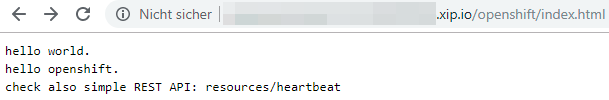

Simple demonstration of S2I. OpenShift will pull source (our webapp) and build an image based on Wildfly (Application Server).

Our Webapp has a index.html page and one REST API.





# OpenShift 4 on local machine with CodeReady Containers
* _CodeReady Containers isn't Minishift- it's an entirely new approach to running Kubernetes locally._

__quickstart (if already setup)__
* start: `crc start` (password will displayed)
* stop: `crc stop`
* open web console: `crc console`
* openshift cli: `~/.crc/bin/oc` (add bin directory in your path)

__virtualbox__
* _removed virtualbox support_: https://github.com/code-ready/crc/issues/838
* _no virtualbox support for linux_: https://github.com/code-ready/crc/issues/625#issuecomment-534385953
* get latest crc (e.g. `crc_virtualbox_4.2.8.crcbundle`) from: https://mirror.openshift.com/pub/openshift-v4/clients/crc/latest/
* run crc: `crc start --vm-driver virtualbox --bundle path_to_system_bundle`

__CodeReady Containers virtual machine__
* with KVM / libvirt (native hypervisor)
* stop the CodeReady Containers virtual machine and OpenShift cluster: `crc stop`
* `crc start` for debug: `crc start --log-level debug`
    * you will _once_ prompt for a image pull secret (a personalized secret)
```
INFO To access the cluster, first set up your environment by following 'crc oc-env' instructions 
INFO Then you can access it by running 'oc login -u developer -p developer https://api.crc.testing:6443' 
INFO To login as an admin, username is 'kubeadmin' and password is 
INFO                                              
INFO You can now run 'crc console' and use these credentials to access the OpenShift web console 
```
* open web console
```
$ crc console
Opening the OpenShift Web Console in the default browser...
```
* show status
```
$ crc status
CRC VM:          Running
OpenShift:       Running (v4.2.8)
Disk Usage:      9.364GB of 32.2GB (Inside the CRC VM)
Cache Usage:     11.01GB
Cache Directory: /home/code/.crc/cache
```

__troubleshooting__
```
$ crc status
ERRO Unable to connect to the server: dial tcp: lookup api.crc.testing: no such host
 - exit status 1 
```
* ubuntu is not officially supported: _Ubuntu 18.04 LTS or newer and Debian 10 or newer are not officially supported and may require manual set up of the host machine._
    * https://code-ready.github.io/crc/#_linux
* simple solution is to use NetworkManager instead systemd-resolver: https://labs.consol.de/devops/linux/2019/11/29/codeready-containers-on-ubuntu.html
* other discussed solutions how to get work crc on ubuntu: https://github.com/code-ready/crc/issues/549

__links__
* https://code-ready.github.io/crc/
* https://github.com/code-ready/crc/releases
* https://developers.redhat.com/products/codeready-containers
* https://developers.redhat.com/openshift/local-openshift/
* https://developers.redhat.com/blog/2019/09/05/red-hat-openshift-4-on-your-laptop-introducing-red-hat-codeready-containers/
* https://libvirt.org/index.html

# OpenShift on local machine

__about__

* this description covers the setup with virtualbox under windows. but virtualbox runs also on Linux and Mac.

__precondition__
* ensure that you have installed VirtualBox on your (local) host machine

__steps to do__

0. our starting point: https://www.okd.io/minishift/
1. download minishift release
https://github.com/minishift/minishift/releases
2. add minishift dir to Path

3. set VirtualBox to minishift
```
minishift config set vm-driver virtualbox
```
* https://docs.okd.io/latest/minishift/getting-started/setting-up-virtualization-environment.html#setting-up-virtualbox-driver
4. start minishift
* i choose version 3.9.0 because versions above make trouble on my machine.
* if you leave memory flag then 4G is default value
```
minishift start --openshift-version v3.9.0 --memory 8G
```
* you can list available openshift versions with the following command
```
minishift openshift version list
```
5. set the oc path to environment 
```
minishift oc-env 
```
* output:
```
SET PATH=%userprofile%\.minishift\cache\oc\v3.9.0\windows;%PATH%
REM Run this command to configure your shell:
REM     @FOR /f "tokens=*" %i IN ('minishift oc-env') DO @call %i
```
* https://docs.okd.io/latest/minishift/getting-started/quickstart.html#starting-minishift

6. now you are ready do use oc cli
```
oc status
In project My Project (myproject) on server https://192.168.99.100:8443
```

7. further commands
* stop minishift
```
minishift stop
```
* delete minishift
```
minishift delete
minishift delete --force --clear-cache
```
* access (openshift) docker
```
minishift ssh -- docker ps
```

8. centos 
* default login root:centos

9. troubleshooting
* if you have connection to port 8443, then ensure to stop process `virtualbox DCHP` in task / process manager.
```
Error: Get https://192.168.0.20:8443/healthz/ready: dial tcp 192.168.0.20:8443: connectex: No connection could be made because the target machine actively refused it
```
