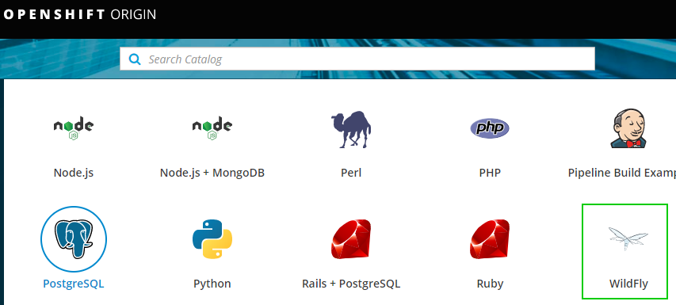

Simple demonstration of S2I. OpenShift will pull source (our webapp) and build an image based on Wildfly (Application Server).

Our Webapp has a index.html page and one REST API.




# OpenShift on local machine

__about__

* this description covers the setup with virtualbox under windows. but virtualbox runs also on Linux and Mac.

__precondition__
* ensure that you have installed VirtualBox on your (local) host machine

__steps to do__

0. our starting point: https://www.okd.io/minishift/
1. download minishift release
https://github.com/minishift/minishift/releases
2. add minishift dir to Path

3. set VirtualBox to minishift
```
minishift config set vm-driver virtualbox
```
* https://docs.okd.io/latest/minishift/getting-started/setting-up-virtualization-environment.html#setting-up-virtualbox-driver
4. start minishift
* i choose version 3.9.0 because versions above make trouble on my machine.
* if you leave memory flag then 4G is default value
```
minishift start --openshift-version v3.9.0 --memory 8G
```
* you can list available openshift versions with the following command
```
minishift openshift version list
```
5. set the oc path to environment 
```
minishift oc-env 
```
* output:
```
SET PATH=%userprofile%\.minishift\cache\oc\v3.9.0\windows;%PATH%
REM Run this command to configure your shell:
REM     @FOR /f "tokens=*" %i IN ('minishift oc-env') DO @call %i
```
* https://docs.okd.io/latest/minishift/getting-started/quickstart.html#starting-minishift

6. now you are ready do use oc cli
```
oc status
In project My Project (myproject) on server https://192.168.99.100:8443
```

7. further commands
* stop minishift
```
minishift stop
```
* delete minishift
```
minishift delete
minishift delete --force --clear-cache
```
* access (openshift) docker
```
minishift ssh -- docker ps
```

8. centos 
* default login root:centos

9. troubleshooting
* if you have connection to port 8443, then ensure to stop process `virtualbox DCHP` in task / process manager.
```
Error: Get https://192.168.0.20:8443/healthz/ready: dial tcp 192.168.0.20:8443: connectex: No connection could be made because the target machine actively refused it
```